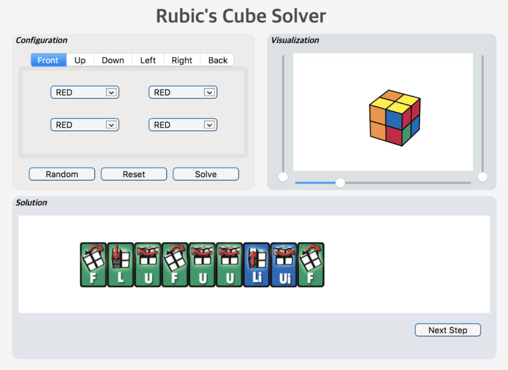

# 2x2 Rubik's Cube Solver
This project is to build up an application for giving a sequence of steps to restore a rubik cube.



### Package contents:
`app.py` define the main function of 2x2 Rubik's Cube Solver

`layout.py` implement the GUI of our solver.

`rubik.py` contains some basic operations and functions of Rubik's cube abstraction. This is inspired by the work of Ronald L. Rivest and Michael Lieberman.

`RubikAbstraction.py` contains utility functions for Rubik's cube solvers. This is inspired by the work of Ronald L. Rivest and Michael Lieberman.

`solver.py` implement the proposed solutions to 2x2x2 Rubik's cube.

`requirement.txt` contains required packages which might need to be installed beforehand.

### Prerequisition

The proposed algorithm and GUI are implemented and tested using Python3.6.5 on macOS High Sierra 10.13.3.

All necessary packages are specified in requirement.txt. Simply start terminal, go to the folder `rubik_app`, and run

```
pip3 install -r requirement.txt
```
If you do not have pip3 installed, visit [pypi.org](https://pypi.org/) for more information

### Run GUI
Start terminal, move to the folder `rubik_app` and run
```
python3 app.py
```
